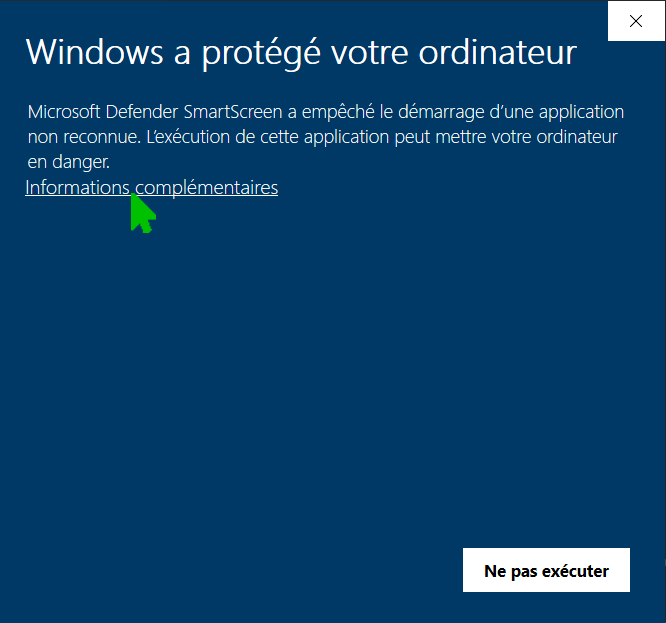
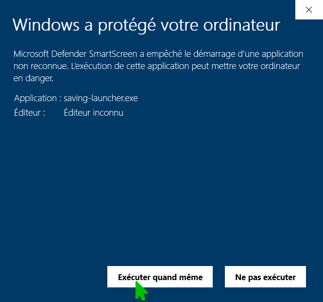

# Image Assistant
Image Assistant is a browser addon, which opens images in any external viewer (having saved them on local disk), thus providing zooming, rotating, & other rich functionality not available by default (including any editing features supported by the viewer). Or 1-click-save without opening...

## Saving Launcher
At present you can download Saving Launcher, which is a native application that Image Assistant depends on, from the following links: Windows ([64-bit](https://github.com/Adazes/imageassistant/raw/v0.9.5.8/dist/platform/Windows/x86-64/saving-launcher.exe)), ([32-bit](https://github.com/Adazes/imageassistant/raw/v0.9.5.8/dist/platform/Windows/x86-32/saving-launcher.exe)); [Linux 64-bit](https://github.com/Adazes/imageassistant/raw/v0.9.5.8/dist/platform/Linux/x86-64/saving-launcher.run).

### Installation on Windows
#### Using console
Nothing special to note about this approach.
#### Without using console

## Issues (if any)
If you encounter an issue, you can log it [here](https://github.com/Adazes/imageassistant/issues).
